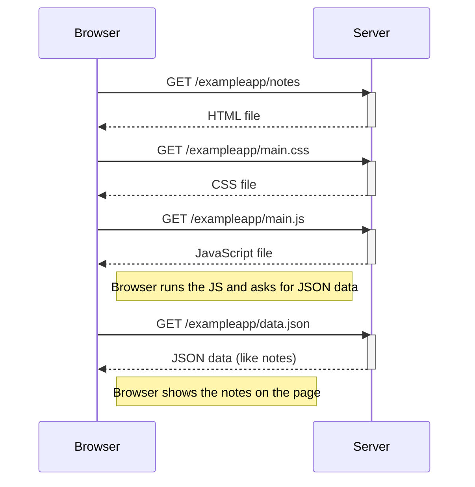

```mermaid
 sequenceDiagram
    participant Browser
    participant Server

    Browser->>Server: GET /exampleapp/notes
    activate Server
    Server-->>Browser: HTML file
    deactivate Server

    Browser->>Server: GET /exampleapp/main.css
    activate Server
    Server-->>Browser: CSS file
    deactivate Server

    Browser->>Server: GET /exampleapp/main.js
    activate Server
    Server-->>Browser: JavaScript file
    deactivate Server

    Note right of Browser: Browser runs the JS and asks for JSON data

    Browser->>Server: GET /exampleapp/data.json
    activate Server
    Server-->>Browser: JSON data (like notes)
    deactivate Server

    Note right of Browser: Browser shows the notes on the page
```
